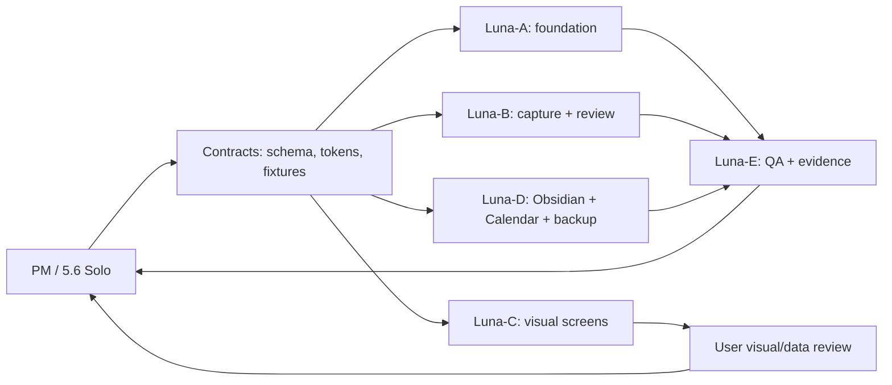

# My Exercise Tracking — Implementation Team and Delivery Plan

**Status:** Pre-implementation team design  
**Date:** 2026-08-06  
**Purpose:** Define ownership, parallel workstreams, visual review gates, and user-data intake before implementation begins

## 1. Team model

### Product Manager / Lead — 5.6 Sol

The PM is the single direct interface with the user and owns:

- product scope, priorities, and tradeoffs;
- interpretation of the PRD/spec and unresolved decisions;
- decomposition into execution tasks;
- dependency and risk management across parallel lines;
- review requests to the user and consolidation of feedback;
- visual review sequencing and approval state;
- progress reports, demo summaries, and next-step recommendations;
- final integration readiness and release acceptance.

The PM does not silently make decisions that materially change privacy, external writes, visual identity, data semantics, or MVP scope. Those return to the user as a bounded decision.

### Execution agents — 5.6 Luna

Each execution agent owns one bounded workstream, produces reviewable artifacts, and reports changes/risks back to the PM. Agents do not directly ask the user product questions, publish external changes, or merge across another workstream's boundaries without PM coordination.

| Agent | Workstream | Primary deliverables |
|---|---|---|
| Luna-A | Foundation and local domain | local Web app shell, SQLite schema/migrations, source-of-truth services, local file paths, profile/goal/plan entities |
| Luna-B | Capture and review | manual workout/health forms, workout image intake, meal image intake, candidate/confirmation states, Review inbox |
| Luna-C | Visual system and screens | design tokens, sidebar, Today Record, Dashboard, Plan, Review, Settings, responsive states, screenshot evidence |
| Luna-D | Projections and integrations | Obsidian Markdown/chart renderer, backup package/restore, Google Calendar gated adapter, sync mappings |
| Luna-E | QA and evidence | fixtures, validation scripts, regression checks, privacy/error cases, accessibility and browser QA |

The available collaboration runtime currently exposes `gpt-5.6-sol` and `gpt-5.6-terra`, but not `gpt-5.6-luna`. The intended execution configuration is Luna for every execution agent; no fallback model should be substituted without an explicit user decision.

## 2. Parallel workstreams

Parallel work is allowed when a line only consumes stable contracts and does not mutate another line's files or semantics.

### Safe parallel batches

**Batch 1 — Contracts and discovery**

- PM finalizes implementation contracts and acceptance slices.
- Luna-A drafts schema/migration boundaries.
- Luna-C drafts token and page wireframes.
- Luna-E prepares fixture/QA matrix.
- Luna-B inventories capture states.
- Luna-D drafts export/integration contracts.

**Batch 2 — Independent vertical foundations**

- local app shell and database;
- design tokens and shell screens;
- fixture data and validators;
- Obsidian templates and backup format;
- capture/review state model.

**Batch 3 — Vertical slices**

- Today Record manual entry;
- workout plan + Plan screen;
- workout Review queue;
- meal photo review;
- Dashboard projection;
- optional Calendar sync slice after local plan flow passes.

**Batch 4 — Integration and hardening**

- connect UI to source-of-truth services;
- regenerate Obsidian notes;
- verify backup/restore;
- run visual/browser QA;
- run privacy/error/regression checks;
- package a reviewable local demo.

## 3. Dependency rules

- SQLite schema and TypeScript/domain contracts are the first shared contract.
- Design tokens and component state names are the visual contract.
- Fixture records and representative images are the extraction/QA contract.
- No agent changes another agent's contract without PM approval.
- Calendar integration starts only after local `workout_plan` and `workout_plan_occurrence` flow is stable.
- Obsidian rendering consumes domain records; it never becomes a write path back into SQLite.
- Visual agents can use mocked fixture data before the domain layer is complete.
- QA can begin with fixtures and contract tests before end-to-end wiring exists.

## 4. Visual review protocol

The user explicitly reviews visuals before final HTML assembly.

1. Luna-C completes one bounded visual unit, such as the shell/sidebar, Today Record, Plan, Review, Dashboard, or Settings.
2. Luna-C renders a screenshot at the agreed desktop viewport and at least one narrow responsive viewport.
3. PM sends the screenshot and a short review prompt to the user, naming what is confirmed, what is provisional, and what feedback is requested.
4. User responds with approval or changes.
5. Luna-C records the decision in the visual checklist and revises the unit if needed.
6. Only approved visual units become inputs to final browser-page assembly.

No final HTML page assembly occurs while any required visual unit is still `needs_review`.

### Visual review order

1. Shell/sidebar and typography tokens
2. Today Record
3. Plan/week view and Calendar sync state
4. Workout/meal Review inbox
5. Dashboard
6. Settings/privacy/backup screens
7. Responsive states and empty/error states

## 5. User data intake protocol

The PM sends one batch request at a time. The user can provide data in folders or a compressed local package; the system should preserve originals and record provenance.

### Needed before capture implementation

- recent LeKe/coach workout screenshots;
- complete exercise/equipment list, grouped under cardio, strength, and stretching/mobility;
- preferred units (kg/lb, minutes, repetitions conventions);
- representative meal photos with any known context, if available;
- one or more body-composition reports/images, including the August 5 baseline;
- preferred Obsidian project root path and confirmation that it can be opened locally without iCloud dependence;
- Google Calendar target account/primary-calendar confirmation when the gated integration begins.

### Needed before visual polish

- 3–5 screenshots from the `o-p-e-n.com` reference that best express typography/components, if pixel-level comparison is desired;
- any personal visual preferences that override the Open reference;
- preferred accent color only if the sage/coral recommendation is not acceptable.

### Data handling rules

- Originals are never overwritten.
- User-provided images receive stable local asset IDs and hashes.
- Extraction candidates remain `needs_review` until user confirmation.
- Fixtures use synthetic or redacted data when possible.
- Health images and tokens never enter Git or external systems by default.

## 6. Reporting protocol

Each agent reports to PM with:

- completed work and artifact paths;
- tests/validation run and result;
- screenshots or other evidence when visual;
- assumptions made;
- blockers and required decisions;
- files/contracts touched;
- next smallest safe task.

PM reports to the user with:

- current product state;
- confirmed decisions;
- visual review requests;
- data needed next;
- risks/blockers;
- what can proceed in parallel;
- explicit next action.

## 7. Definition of ready for implementation

Implementation begins only when:

- the user accepts this team/process design or specifies changes;
- the Luna runtime is available, or the user explicitly approves a fallback;
- the first data batch is available or the user approves synthetic fixtures;
- visual review order and screenshot handoff are accepted;
- the core local slice is prioritized ahead of optional Calendar integration;
- no unresolved decision would change the domain model or visual shell materially.

## 8. First implementation milestone

The first milestone should be a reviewable local shell, not the whole product:

- local Web app starts in a browser;
- sidebar and Today Record shell render with approved tokens;
- fixture-driven daily record appears;
- screenshot is sent to the user for visual review;
- no Google Calendar write and no external AI call occurs in this milestone.

